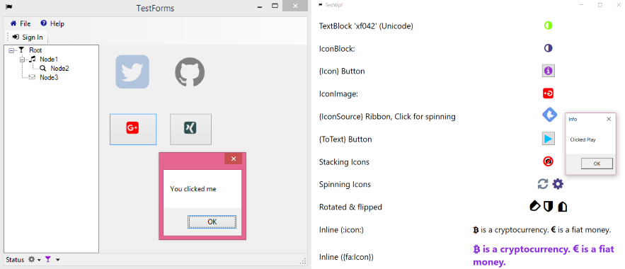
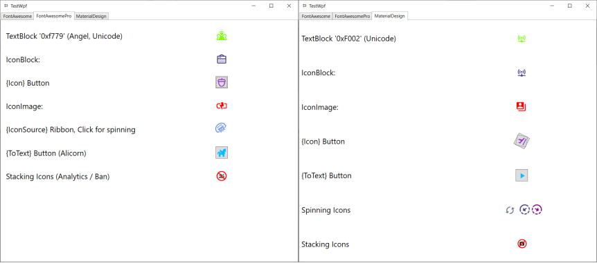
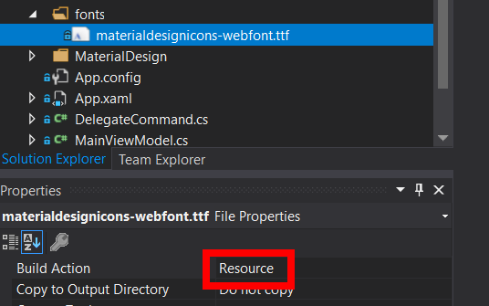

# FontAwesome.Sharp

[](https://github.com/awesome-inc/FontAwesome.Sharp/actions/workflows/build.yml)
[](https://www.nuget.org/packages/FontAwesome.Sharp/)
[](https://www.nuget.org/packages/FontAwesome.Sharp/)
[](https://sonarcloud.io/dashboard?id=awesome-inc_FontAwesome.Sharp)

<!-- [](https://coveralls.io/github/awesome-inc/FontAwesome.Sharp) -->

A library for embbeding [Font Awesome](http://fortawesome.github.io/Font-Awesome/) icons in WPF & Windows Forms applications via [NuGet](http://www.nuget.org/). Inspired by [ioachim/fontawesome.wpf (BitBucket)](https://bitbucket.org/ioachim/fontawesome.wpf) and [Using Font Icons (CodeProject)](http://www.codeproject.com/Tips/634540/Using-Font-Icons).

Here is a screenshot from the sample applications



Here is a screenshot from the WPF sample application show-casing using also other icon fonts like

- **FontAwesome Pro** and
- **MaterialDesign**:



Don't miss out the community tutorials on YouTube, e.g.

- RJ Code Advance EN: [C#/ Modern Flat UI + Font Awesome Icons, Multicolor, Highlight button, WinForm](https://www.youtube.com/watch?v=5AsJJl7Bhvc)
- RJ Code Advance EN: [VB/ Form Moderno + Iconos Font Awesome, Multicolor, Resaltar botón, WinForm-Visual Basic .NET](https://www.youtube.com/watch?v=1BYqAopxpfg)

How to

- [Installation](#installation)
- Use with [WPF](#wpf)
- Use with [Windows Forms](#windows-forms)
- Use [Font Awesome Pro](#using-fontawesome-pro)
- [Use custom fonts](#using-custom-fonts) other than Font Awesome, e.g. [Material Design Icons](https://materialdesignicons.com/)

See also

- [Frequently Asked Questions (FAQ)](#faq).

## Installation

Add the NuGet package to your WPF or Windows Forms application or library. From the Package Manager Console type

```powershell
Install-Package FontAwesome.Sharp
```

## Windows Forms

For Windows Forms projects use the subclasses

- `IconButton`,
- `IconToolStripButton`,
- `IconDropDownButton`,
- `IconMenuItem`,
- `IconPictureBox` or
- `IconSplitButton`,

respectively.

If you just want to generate a bitmap for an icon, use the `ToBitmap()/ToImageSource`-extension like this

```csharp
var bitmap = IconChar.BatteryEmpty.ToBitmap(16, Color.Black); // Windows Forms
var image = IconChar.BatteryEmpty.ToImageSource(Brushes.Black, 16); // WPF

var customFontBitmap = MyCustomFont.ToBitmap(MyEnum.SomeIcon, 16, Color.Black); // Windows Forms, custom font
var customFontImage = MyCustomFont.ToImageSource(MyEnum.SomeIcon, Brushes.Black, 16); // WPF, custom font
```

For more details including setting the application icon or using a treeview, have a look at the sample application `TestForms`.

## WPF

After installation, add the XAML namespace and you are good to go

```xml
<Window
  xmlns:fa="http://schemas.awesome.incremented/wpf/xaml/fontawesome.sharp">
...
</Window>
```

If you use WPF you may remove the references to

- `System.Windows.Forms`
- `System.Drawing`

You can add iconic items to your views in the following ways

- `<TextBlock />` using the FontAwesome font family directly,
- `<IconBlock />`,
- `{fa:Icon [Icon]}`,
- `{fa:ToText [Icon]}`,
- `<fa:IconImage />`,
- `{fa:IconSource [Icon]}`
- `<fa:IconToImageConverter />`

More details are given below. Be sure to have a look at the sample application `TestWpf`.

### Text

The most rudimentary way is to use _FontAwesome_ directly with a `TextBlock` like

```xml
<TextBlock Grid.Column="1" Text="&#xf042;"
    FontFamily="/FontAwesome.Sharp;component/fonts/#Font Awesome 5 Free Solid"
    Foreground="Chartreuse"
    TextAlignment="Center" />
```

However, you need to have the [FontAwesome Cheatsheet](http://fortawesome.github.io/Font-Awesome/cheatsheet/) on your knees to know the icons correct unicodes.

**Note:** Since fontawesome 5+, the brand icons have been moved to a separate brands fonts. So you are better off using the following components which take care of auto-selecting the font for the respective icon.

#### Inline text

As of [v4.6.3](https://www.nuget.org/packages/FontAwesome.Sharp/4.6.3) inline parsing was added ([#2](https://github.com/awesome-inc/FontAwesome.Sharp/issues/2)), thx to [@furesoft](https://github.com/furesoft) for the nice idea. Here is an example

```xml
<TextBlock fa:Awesome.Inline=":Bitcoin: is a cryptocurrency. :EuroSign: is a fiat money." />
```

Usually, you will bind some text from your view model, say

```xml
<TextBlock fa:Awesome.Inline="{Binding MyInlineText}" />
```

where `MyViewModel.MyInlineText` may be some text like _":Bitcoin: is a cryptocurrency. :EuroSign: is a fiat money."_.

This works by creating inline [Runs](<https://msdn.microsoft.com/en-us/library/system.windows.documents.run(v=vs.110).aspx>) switching fonts to **FontAwesome** while preserving
all other font related properties of the `TextBlock` like color, weight and size.

The default RegEx pattern for parsing the icon names is `:(\w+):`.
It can be customized using the `Awesome.Pattern`-property. Any pattern with the first group matching the icon name (case insensitive) should work. An example:

```xml
<TextBlock fa:Awesome.Pattern="{}{fa:(\w+)}"
    fa:Awesome.Inline="{}{fa:Bitcoin} is a cryptocurrency. {fa:EuroSign} is a fiat money."
    />
```

**Note** that in Xaml you should declare the `Pattern`-property **before** the `Inline`-property.

#### `<fa:IconBlock />`

To use _FontAwesome_-icons in text you can use the `IconBlock` which subclasses the standard WPF [TextBlock](http://msdn.microsoft.com/en-us/library/system.windows.controls.textblock.aspx). You can the set the corresponding _Font Awesome_ icon via the `Icon`-property:

```xml
<fa:IconBlock Icon="Home" Foreground="Blue" />
```

### Buttons

The most typical use case for icons is buttons. Of course you can use `IconBlock` with element-style syntax:

```xml
<Button>
    <Button.Content>
        <fa:IconBlock Icon="Info" Foreground="Chocolate"/>
    </Button.Content>
</Button>
```

However, this is awfully long code for just having an icon.

#### `{fa:Icon [Icon]}`

the `Icon` markup extension allows for a shorthand notation to create an `IconBlock` using the attribute syntax:

```xml
<Button Content="{fa:Icon InfoCircle, Foreground=Chocolate}"/>
```

#### `{fa:ToText [Icon]}`

Using the `ToText` markup extension is most recommended when using the font. It translates an `IconChar` to a `string` capturing the icon´s unicode. Here is an example

```xml
<Button Content="{fa:ToText Play}" />
```

And here a default style

```xml
<Style TargetType="Button">
    <Setter Property="FontFamily" Value="/FontAwesome.Sharp;component/fonts/#Font Awesome 5 Free Solid"/>
    <Setter Property="FontSize" Value="18" />
    <Setter Property="VerticalAlignment" Value="Center"/>
    <Setter Property="HorizontalAlignment" Value="Center"/>
    <Setter Property="Margin" Value="4" />
    <Setter Property="Padding" Value="4" />
    <Setter Property="Width" Value="32" />
    <Setter Property="Height" Value="32" />

    <Setter Property="Foreground" Value="DeepSkyBlue"/>
    <Style.Triggers>
        <Trigger Property="IsMouseOver" Value="True">
            <Setter Property="Foreground" Value="LightSkyBlue"/>
        </Trigger>
    </Style.Triggers>
</Style>
```

**Note:** Since fontawesome 5+, the brand icons have been moved to a separate brands fonts. Try avoiding to hardcode the font family name unless you know all icons used with the style are contained in the font.

### Images

#### `<fa:IconImage />`

Use this control when you are restricted to images and cannot use `IconBlock`.
It subclasses the standard WPF [Image](<http://msdn.microsoft.com/en-us/library/system.windows.controls.image(v=vs.110).aspx>)
for convenience. Again, you can set the corresponding Font Awesome element via the `Icon`-property like this

```xml
<fa:IconImage Icon="Ambulance" Foreground="Red" Width="24" Height="24"/>
```

You can additionally change the color with the `Foreground`-property.

### ImageSource (RibbonButton)

#### `{fa:IconSource [Icon]}`

When you are restricted to [ImageSource](<http://msdn.microsoft.com/en-us/library/system.windows.media.imagesource(v=vs.110).aspx>>>) like with the WPF [Ribbon](<http://msdn.microsoft.com/en-us/library/ff799534(v=vs.110).aspx>)
control you can use the `IconSource` markup extension like:

```xml
<RibbonButton SmallImageSource="{fa:IconSource InfoCircle, Foreground=Red"/>
```

### Menus and MVVM

For `MenuItem` you want to set the `Icon` property via an `<fa:IconImage />`. However, in MVVM scenarios you want to bind the icon of a view-model to the menu item. This can be done with the `IconToImageConverter` like this

```xml
<Window.Resources>
    <fa:IconToImageConverter x:Key="IconToImage"/>
</Window.Resources>
<Window.ContextMenu>
    <ContextMenu>
        <MenuItem Command="Open" Icon="{Binding Icon, Converter={StaticResource IconToImage}}"/>
    </ContextMenu>
</Window.ContextMenu>
```

where the view model looks like this

```csharp
public class MainViewModel
{
    public IconChar Icon { get; set; }
}
```

and the window `DataContext` is initialized for instance like this

```csharp
public partial class MainWindow
{
    public MainWindow()
    {
        InitializeComponent();

        DataContext = new MainViewModel {Icon = IconChar.Apple};
    }
}
```

#### Styling the converted menu images

Often you want to have the menu icons all have a consistent style (e.g. size and foreground). To achieve this you can configure the `IconToImageConverter` like this

```xml
<Brush x:Key="FaBrush">DarkOrchid</Brush>
<Style TargetType="Image" x:Key="FaImageStyle">
    <Setter Property="Width" Value="20"/>
    <Setter Property="Height" Value="20"/>
</Style>
<fa:IconToImageConverter x:Key="IconToImage"
    Foreground="{StaticResource FaBrush}"
    ImageStyle="{StaticResource FaImageStyle}"/>
```

## Using FontAwesome Pro

To use your licensed version of [Font Awesome Pro](https://fontawesome.com/pro) just add the respective
[TrueType](https://en.wikipedia.org/wiki/TrueType) font files as embedded resources.

**NOTE:** The prebuilt package `FontAwesome.Sharp.Pro` contains only the generated icon-Enumerations

- `ProIcons`
- `DuoToneIcons`

See the `TestWPF` sample application for an example on how to use icons from **Font Awesome Pro**.

They have been generated from the css-Definitions like any other [Custom font](#using-custom-fonts) (see below):

```console
$ FontEnumGenerator.exe --css Content\fontawesome-pro.css --name ProIcons --namespace FontAwesome.Sharp.Pro
Matched 2293 icons from 'Content\fontawesome-pro.css' using '\.fa-(.+):before'
Generated 'ProIcons.cs'.

$ FontEnumGenerator.exe --css Content\duotone-pro.css --pattern "\.fad.fa-(.+):after" --namespace FontAwesome.Sharp.Pro
Matched 1851 icons from 'Content\duotone-pro.css' using '\.fad.fa-(.+):after'
Generated 'DuoToneIcons.cs'.
```

The actual fonts are

## Using custom fonts

As of version _5.2+_ it is easy to reuse the library with other icon fonts (see e.g. [Vector Icons Roundup](https://tagliala.github.io/vectoriconsroundup/) for a comparative list).

See the `TestWPF` or the `TestForms` sample application for an example on how to use [Material Design Icons](https://materialdesignicons.com/).

The steps to use your own icon font are laid out below with Google's Material Design Icons as an example:

1. Download the web font, e.g. [Templarian/MaterialDesign-Webfont](https://github.com/Templarian/MaterialDesign-Webfont/releases). You will need the `.css` and the `.ttf` files. Alternatively use the npm font package [@mdi/font](https://www.npmjs.com/package/@mdi/font)
2. Generate the font icon enum class using `FontEnumGenerator`

   ```console
   $ FontEnumGenerator.exe --css Content\materialdesignicons.css --pattern "\.mdi-(.+):before" --name MaterialIcons
   Matched 5345 icons from 'Content\materialdesignicons.css' using '\.mdi-(.+):before'
   Generated 'MaterialIcons.cs'.
   ```

   This will parse the `.css` file and generate an enumeration class `MaterialIcons.cs` with the UTF8-codes of all css-items matching the specified prefix `.mdi-*-before`, cf.

   ```css
    .mdi-access-point:before {
    content: "\F002";
    }

    .mdi-access-point-network:before {
    content: "\F003";
    }
    ...
   ```

   ```csharp
    public enum MaterialIcons
    {
        None = 0,
        AccessPoint = 0xF002,
        AccessPointNetwork = 0xF003,
        ...
   ```

3. Add the generated class and the font file (`.ttf`) to your project. Check that `Build Action` is set to `Resource` for the font file.

   

4. Load the font and declare icon classes using the enum and the corresponding font.

   ```csharp
   internal static class MaterialDesignFont
   {
       internal static readonly FontFamily FontFamily =
           Assembly.GetExecutingAssembly().GetFont("fonts", "Material Design Icons");
   }
   ...
   public class IconBlock : IconBlockBase<MaterialIcons>
   {
       public IconBlock() : base(MaterialDesignFont.FontFamily)
       {
       }
   }
   ...
   ```

   You can find the font title by inspecting the File properties.

   

5. Use your custom classes, e.g. with Xaml

   ```xml
   <Window x:Class="TestWpf.MainWindow"
       ...
       xmlns:mdi="clr-namespace:TestWpf.MaterialDesign">
       ...
       <mdi:IconBlock Icon="AccessPointNetwork" FontSize="24" Foreground="DarkSlateBlue" />
       ...
   ```

   which will look like this

   

## Related Projects

Other libraries for using FontAwesome in Windows applications that we know of and are available on NuGet:

- [FontAwesome.Portable](http://www.nuget.org/packages/FontAwesome.Portable/): Great idea to make it a portable library. However, we could not find the source repository.
- [charri/Font-Awesome-WPF](https://github.com/charri/Font-Awesome-WPF): Clean and nice implementation. Icon metadata and spinning support are really cool.
- [FontAwesome-WindowsForms](https://github.com/denwilliams/FontAwesome-WindowsForms): An example implementation for Windows Forms. We adapted this for **FontAwesome.Sharp.4.4.0**.

In production, however, we needed to support

- Ribbons using ImageSource (not only Image),
- MVVM with Icon enum (smaller memory footprint on the viewmodel than Image),
- more markup extensions to keep the Xaml compact
- and finally `Windows.Forms` as well.

## FAQ

### How does it work?

Rendering Glyph Fonts / Font icons basically works by looking up the [Glyph](https://en.wikipedia.org/wiki/Glyph)-symbols from the respective fonts using their [Unicode](https://en.wikipedia.org/wiki/List_of_Unicode_characters) and
drawing them as text.

In the Web this has been a simple and effective design option for quite a long time.
However, for most Desktop application frameworks there is no or only little support.

The way we support icon fonts in Desktop Application Frameworks like [WPF](https://en.wikipedia.org/wiki/Windows_Presentation_Foundation) and [Windows Forms](https://en.wikipedia.org/wiki/Windows_Forms) is by

1. Embedding the [TrueType (.ttf)](https://en.wikipedia.org/wiki/TrueType) as [Embbedded Resources](https://docs.microsoft.com/en-us/dotnet/framework/resources/creating-resource-files-for-desktop-apps),
2. Generating [Enumeration types](https://docs.microsoft.com/en-us/dotnet/csharp/language-reference/builtin-types/enum) from the web glyph definitions (usually in [CSS](https://en.wikipedia.org/wiki/Cascading_Style_Sheets)) and
3. Providing Interop-code between Text-Rednering and the UI-Primitives of the Desktop Application Framework.

### Windows Forms Designer: I cannot find any controls in the Toolbox

Add the controls to the toolbox as described in this SO answer: [How do I add my new User Control to the Toolbox or a new Winform?](http://stackoverflow.com/questions/8931328/how-do-i-add-my-new-user-control-to-the-toolbox-or-a-new-winform#8931414)

Note that with recent NuGet versions you will usually find installed NuGet packages in `%USERPROFILE%\.nuget\packages`.

### My Windows Forms application gets rescaled once a FontAwesome-item is created

Windows 10 (.NET 4.7+) you can enable DPI awareness in your windows forms application by adding

```xml
<System.Windows.Forms.ApplicationConfigurationSection>
  <add key="DpiAwareness" value="PerMonitorV2" />
</System.Windows.Forms.ApplicationConfigurationSection>
```

to your `app.config`. For more information see

- [Configuring your Windows Forms app for high DPI support](https://docs.microsoft.com/en-us/dotnet/framework/winforms/high-dpi-support-in-windows-forms#configuring-your-windows-forms-app-for-high-dpi-support)
- [FontAwesome.Sharp/issues/23](https://github.com/awesome-inc/FontAwesome.Sharp/issues/23)

### Strong name Signing (e.g. for ClickOnce Publishing)

We don't think Strong Name Signing is still a good thing to do. Here is one possible rationale for this:

- [Still Strong-Naming your Assemblies? You do know it’s 2016, right?](https://www.pedrolamas.com/2016/03/01/still-strong-naming-your-assemblies-you-do-know-its-2016-right/)

If you do need to strong name your software (e.g. you do ClickOnce Publishing), here are some alternatives:

- Merge into your project using [Fody/Costura](https://github.com/Fody/Costura)
- Post-Build Strong Name Signing using [brutaldev/StrongNameSigner](https://github.com/brutaldev/StrongNameSigner)

Here is an MSBuild snippet/example of how i got this working in 2015 with `StrongNameSigner` (no warranty of still working)

```xml
<!--Strong naming assemblies -->
<ItemGroup>
    <!--strong name font awesome sharp -->
    <StrongNameAssembly Include="$(SolutionDir)packages\FontAwesome.Sharp.*\lib\**\*.dll" />
</ItemGroup>

<!-- Strong naming dependencies -->
<Target Name="StrongName" BeforeTargets="PrepareForBuild" Condition="'$(NCrunch)' != '1'">
    <PropertyGroup>
        <StrongNameSignerPath>$(SolutionDir)packages\Brutal.Dev.StrongNameSigner.*\tools\StrongNameSigner.Console.exe</StrongNameSignerPath>
    </PropertyGroup>
    <ItemGroup>
        <StrongNameSigner Include="$(StrongNameSignerPath)"/>
        <StrongNameDirs Include="@(StrongNameAssembly->DirectoryName())"/>
        <UniqueDirs Include="@(StrongNameDirs->Distinct())"/>
    </ItemGroup>
    <PropertyGroup>
        <StrongNameArgs>&quot;@(UniqueDirs,'|')&quot;</StrongNameArgs>
    </PropertyGroup>

    <Message Condition="'$(StrongNameArgs)' != '&quot;&quot;'"
        Text="Strong name signing $(StrongNameArgs)..." Importance="High"/>
    <Exec Condition="'$(StrongNameArgs)' != '&quot;&quot;'" ContinueOnError="false"
        Command="&quot;@(StrongNameSigner->'%(FullPath)')&quot; -in $(StrongNameArgs) > strongName.log" />
</Target>
```

Include this in your `.csproj` and you should be good to go!

### All icons seem to be rendered with Regular style. How to render solid or brand icons

In fontawesome, **regular** and **solid** icons use different font/ttf-files. Since **regular/solid** have overlapping icons and **regular** is the first font in the list
the glyphs in the regular-font will be preferred.

As of 5.15+ the font style can be explicitly set, e.g.

```csharp
this._openMenuItem.IconChar = FontAwesome.Sharp.IconChar.File;
this._openMenuItem.IconFont = IconFont.Solid;
this._openMenuItem.Name = "_openMenuItem";
```


To render an icon directly to a bitmap using a specific font style

```csharp
var bitmap = IconChar.GoogleDrive.ToBitmap(IconFont.Brands);
```
