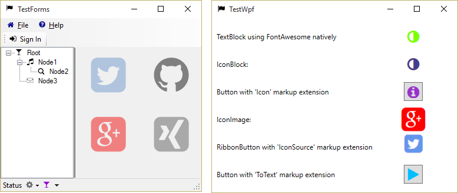

# FontAwesome.Sharp

A library for embbeding [Font Awesome](http://fortawesome.github.io/Font-Awesome/) icons in WPF & Windows Forms applications via [NuGet](http://www.nuget.org/). Inspired by [ioachim/fontawesome.wpf (BitBucket)](https://bitbucket.org/ioachim/fontawesome.wpf) and [Using Font Icons (CodeProject)](http://www.codeproject.com/Tips/634540/Using-Font-Icons).

 
 

 

Here is a screenshot from the sample application

## Installation

Add the NuGet package to your WPF or Windows Forms application or library. From the Package Manager Console type

    Install-Package FontAwesome.Sharp

## How to use

### Windows Forms

For Windows Forms projects use the subclasses

- `IconButton`,
- `IconToolStripButton`,
- `IconDropDownButton`,
- `IconMenuItem`,
- `IconPictureBox` or
- `IconSplitButton`,

respectively. For more details including setting the application icon or using a treeview, have a look at the sample application `TestForms`.

### WPF

If you use WPF you may remove the references to

- `System.Windows.Forms`
- `System.Drawing`

You can add iconic items to your views in the following ways

- `<TextBlock />` using the FontAwesome directly,
- `<IconBlock />`,
- `{fa:Icon [Icon]}`,
- `{fa:ToText [Icon]}`,
- `<fa:IconImage />`,
- `{fa:IconSource [Icon]}`
- `<fa:IconToImageConverter />`

More details are given below. Be sure to have a look at the sample application `TestWpf`.

### Text

The most rudimentary way is to use *FontAwesome* directly with a `TextBlock` like

    <TextBlock Grid.Column="1" Text="&#xf042;" 
      FontFamily="/FontAwesome.Sharp;component/fonts/#FontAwesome"
      Foreground="Chartreuse"
      TextAlignment="Center" />

However, you need to have the [FontAwesome Cheatsheet](http://fortawesome.github.io/Font-Awesome/cheatsheet/) on your knees to know the icons correct unicodes.

#### Inline text

As of [v4.6.3](https://www.nuget.org/packages/FontAwesome.Sharp/4.6.3) inline parsing was added ([#2](https://github.com/awesome-inc/FontAwesome.Sharp/issues/2)), thx to [@furesoft](https://github.com/furesoft) for the nice idea. Here is an example

    <TextBlock fa:Awesome.Inline=":btc: is a cryptocurrency. :Eur: is a fiat money." />

Usually, you will bind some text from your view model, say

    <TextBlock fa:Awesome.Inline="{Binding MyInlineText}" />

where `MyViewModel.MyInlineText` may be some text like *":btc: is a cryptocurrency. :Eur: is a fiat money."*.

This works by creating inline [Runs](https://msdn.microsoft.com/en-us/library/system.windows.documents.run(v=vs.110).aspx) switching fonts to **FontAwesome** while preserving
all other font related properties of the `TextBlock` like color, weight and size.

The default RegEx pattern for parsing the icon names is `:(\w+):`.
It can be customized using the `Awesome.Pattern`-property. Any pattern with the first group matching the icon name (case insensitive) should work. An example:

    <TextBlock fa:Awesome.Pattern="{}{fa:(\w+)}"
        fa:Awesome.Inline="{}{fa:Btc} is a cryptocurrency. {fa:eur} is a fiat money."
     />

**Note** that in Xaml you should declare the `Pattern`-property **before** the `Inline`-property.

#### `<fa:IconBlock />`

To use *FontAwesome*-icons in text you can use the `IconBlock` which subclasses the standard WPF [TextBlock](http://msdn.microsoft.com/en-us/library/system.windows.controls.textblock.aspx). You can the set the corresponding *Font Awesome* icon via the `Icon`-property:

  <fa:IconBlock Icon="Home" Foreground="Blue" /> 

### Buttons

The most typical use case for icons is buttons. Of course you can use `IconBlock` with element-style syntax:

    <Button>
        <Button.Content>
            <fa:IconBlock Icon="Info" Foreground="Chocolate"/>
        </Button.Content>
    </Button>

However, this is awfully long code for just having an icon.

#### `{fa:Icon [Icon]}`

the `Icon` markup extension allows for a shorthand notation to create an `IconBlock` using the attribute syntax:

    <Button Content="{fa:Icon InfoCircle, Foreground=Chocolate}"/>

#### `{fa:ToText [Icon]}`

Using the `ToText` markup extension is most recommended when using the font. It translates an `IconChar` to a `string` capturing the icon´s unicode. Here is an example

    <Button Content="{fa:ToText Play}" />

And here a default style

    

### Images

#### `<fa:IconImage />`

Use this control when you are restricted to images and cannot you `IconBlock`. It subclasses the standard WPF [Image](http://msdn.microsoft.com/en-us/library/system.windows.controls.image(v=vs.110).aspx) for convenience. Again, you can set the corresponding Font Awesome element via the `Icon`-property like this
    
        <fa:IconImage Icon="Ambulance" Foreground="Red" Width="24" Height="24"/>
You can additionally change the color with the `Foreground`-property.

### ImageSource (RibbonButton)

#### `{fa:IconSource [Icon]}`

When you are restricted to [ImageSource](http://msdn.microsoft.com/en-us/library/system.windows.media.imagesource(v=vs.110).aspx) like with the WPF [Ribbon](http://msdn.microsoft.com/en-us/library/ff799534(v=vs.110).aspx) control you can use the `IconSource` markup extension like:

    <RibbonButton SmallImageSource="{fa:IconSource InfoCircle, Foreground=Red"/>

### Menus and MVVM

For `MenuItem` you want to set the `Icon` property via an `<fa:IconImage />`. However, in MVVM scenarios you want to bind the icon of a view-model to the menu item. This can be done with the `IconToImageConverter` like this

    <Window.Resources>
        <fa:IconToImageConverter x:Key="IconToImage"/>
    </Window.Resources>
    <Window.ContextMenu>
        <ContextMenu>
            <MenuItem Command="Open" Icon="{Binding Icon, Converter={StaticResource IconToImage}}"/>
        </ContextMenu>
    </Window.ContextMenu>
 
where the view model looks like this

    public class MainViewModel
    {
        public IconChar Icon { get; set; }
    }

and the window `DataContext` is initialized for instance like this

    public partial class MainWindow
    {
        public MainWindow()
        {
            InitializeComponent();

            DataContext = new MainViewModel {Icon = IconChar.Apple};
        }
    }

#### Styling the converted menu images

Often you want to have the menu icons all have a consistent style (e.g. size and foreground). To achieve this you can configure the `IconToImageConverter` like this

    <Brush x:Key="FaBrush">DarkOrchid</Brush>
    
    <fa:IconToImageConverter x:Key="IconToImage" 
    	Foreground="{StaticResource FaBrush}" 
    	ImageStyle="{StaticResource FaImageStyle}"/>

## Related Projects

Other libraries for using FontAwesome in Windows applications that we know of and are available on NuGet:

- [FontAwesome.Portable](http://www.nuget.org/packages/FontAwesome.Portable/)
Great idea to make it a portable library. However, we could not find the source repository.
- [charri/Font-Awesome-WPF](https://github.com/charri/Font-Awesome-WPF): Clean and nice implementation. Icon metadata and spinning support are really cool. 
- [FontAwesome-WindowsForms](https://github.com/denwilliams/FontAwesome-WindowsForms): An example implementation for Windows Forms. We adapted this for **FontAwesome.Sharp.4.4.0**.

In production, however, we needed to support
 
- Ribbons using ImageSource (not only Image), 
- MVVM with Icon enum (smaller memory footprint on the viewmodel than Image), 
- more markup extensions to keep the Xaml compact
- and finally `Windows.Forms` as well.

## FAQ

### Windows Forms Designer: I cannot find any controls in the Toolbox

Add the controls to the toolbox as described in this SO answer: [How do I add my new User Control to the Toolbox or a new Winform?](http://stackoverflow.com/questions/8931328/how-do-i-add-my-new-user-control-to-the-toolbox-or-a-new-winform#8931414)
